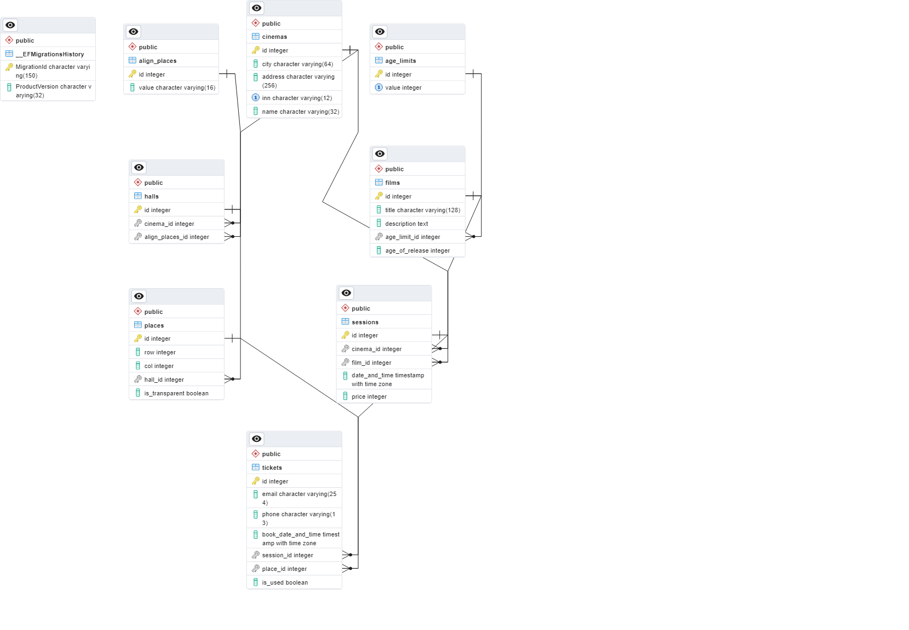

# Tickets booking API
### *A simple CRUD API for booking tickets.*

### API is written on
* ASP.Net core web API
* PostgreSQL

Also, I used **DB first design**.

## Database schema


## Run project
1. Create *appsettings.json* file
```{
  "Logging": {...},
  "AllowedHosts": "...",
  "ConnectionStrings": {
    "TicketsDatabase": "postgreSQL connection string"
  }
}
```
2. Install dotnet ef tool ```dotnet tool install --global dotnet-ef```
3. Apply migrations to the database ```dotnet ef database update```
4. Run project ```dotnet run urls="https://localhost:8000"```

**You can open Swagger UI at https://localhost:8000/swagger**